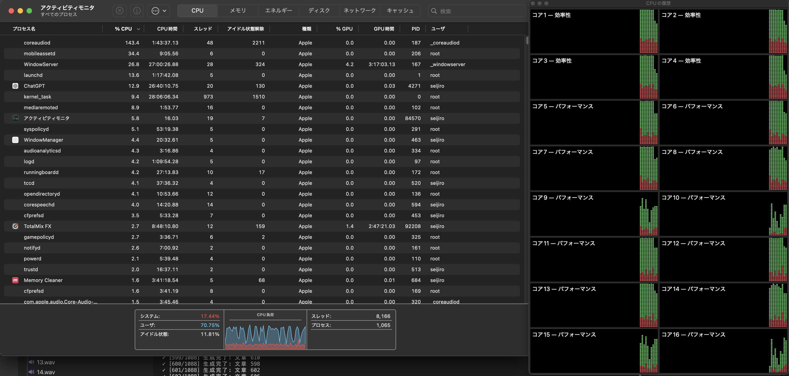

# pdf2audio

## usage:

set your pdf file name in p3.py(line:204)

```bash
pip install -r requirements.txt
python p3.py
```

## performance

at m4max, to make 5:08:04 file, it takes about 410sec.

```
  500/1087 セグメント連結済み...
  600/1087 セグメント連結済み...
  700/1087 セグメント連結済み...
  800/1087 セグメント連結済み...
  900/1087 セグメント連結済み...
  1000/1087 セグメント連結済み...

最終ファイルを書き出し中...
✓ 連結完了: sample.pdf.wav
  ファイルサイズ: 1558.30 MB
  再生時間: 308.77 分

=== パフォーマンス ===
音声生成時間: 323.07秒 (5.38分)
総処理時間: 410.06秒 (6.83分)
1文あたり: 0.297秒
実効スピードアップ: 約16.8倍

全ての処理が完了しました！
最終出力ファイル: /Users/seijiro/Sync/sync_work/book2audio/sample.pdf.wav

```


